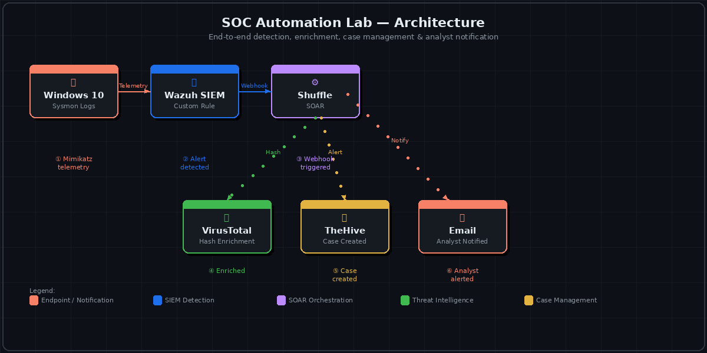

<h1 align="center">🛡️ SOC Automation Lab</h1>

<p align="center">
  <b>End-to-end Security Operations Center automation — Detection → Enrichment → Case Management → Analyst Notification</b>
</p>

<p align="center">
  
  
  
  
  
  
</p>

---

## 🎯 Project Objective

Build a fully automated SOC environment that simulates a **real-world Tier-1 analyst workflow** — from endpoint telemetry and threat detection, all the way through automated enrichment, case creation, and analyst notification — with **zero manual steps between detection and triage**.

> This project demonstrates how modern SOC teams use automation to reduce alert fatigue, cut MTTR, and ensure no alert is missed.

---

## 🏗️ Architecture



| Step | Component | Role |
|---|---|---|
| ① | Windows 10 + Sysmon | Endpoint telemetry generation |
| ② | Wazuh SIEM | Log ingestion + custom detection rule |
| ③ | Shuffle SOAR | Webhook trigger + workflow orchestration |
| ④ | VirusTotal API | SHA-256 hash enrichment + reputation check |
| ⑤ | TheHive | Automated case creation + incident management |
| ⑥ | Email | Analyst notification with enriched context |

---

## 🔄 How It Works — The Full Workflow

```
Windows 10 Endpoint (Sysmon)
        │
        │  Security telemetry (Mimikatz-style activity)
        ▼
  Wazuh Manager
        │
        │  Custom rule fires → alert generated
        │  ossec.conf integration → webhook POST
        ▼
  Shuffle SOAR  ──────────────────────────────────────┐
        │                                              │
        │  REX parse → extract SHA-256 hash            │
        ▼                                              │
  VirusTotal API v3                                    │
        │                                              │
        │  Hash reputation + malicious detection count  │
        ▼                                              ▼
   TheHive                                          Email
  (Case Created)                           (Analyst Notified)
```

**The key detail:** Wazuh is configured to forward **only the targeted rule ID** to Shuffle (not all alerts) — this prevents noise and mirrors how real SOC automation is built: targeted, not broad.

---

## 🛠️ Tools & Technologies

| Tool | Purpose | Version/Type |
|---|---|---|
| **Wazuh** | SIEM / XDR — log ingestion, detection, alerting | Open Source |
| **Sysmon** | Windows endpoint telemetry — detailed process/network logs | Microsoft Sysinternals |
| **Shuffle** | SOAR — workflow orchestration, API integrations | Open Source |
| **TheHive** | Case management — structured incident tracking | Open Source |
| **VirusTotal** | Threat intelligence — hash reputation enrichment | API v3 |
| **AWS** | Cloud infrastructure — VM hosting | EC2 |
| **Mimikatz** | Credential dumping simulation — generates test telemetry | Offensive tool (lab only) |

---

## ⚙️ Implementation Steps

### Step 1 — Design the Architecture
- Drew a logical diagram mapping all components and data flows before building
- Identified integration points: Wazuh → Shuffle (webhook), Shuffle → VirusTotal (API), Shuffle → TheHive (API), Shuffle → Email (SMTP)

### Step 2 — Deploy Cloud Infrastructure (AWS)
- Launched 3 EC2 instances:
  - `Wazuh Manager` — Ubuntu server
  - `TheHive Server` — Ubuntu server
  - `Windows 10` — Windows endpoint with Sysmon

### Step 3 — Configure Wazuh Detection
- Installed Wazuh agent on the Windows endpoint and connected it to the Wazuh Manager
- Wrote a **custom detection rule** targeting Mimikatz-style process behavior
- Configured `ossec.conf` integration block with Shuffle webhook URL
- Set rule filtering to forward only the **specific rule ID** (not all alerts) to reduce noise

```xml
<!-- ossec.conf — targeted webhook integration -->
<integration>
  <name>shuffle</name>
  <hook_url>https://shuffler.io/api/v1/hooks/YOUR_WEBHOOK</hook_url>
  <rule_id>100002</rule_id>
  <alert_format>json</alert_format>
</integration>
```

### Step 4 — Generate Endpoint Telemetry
- Deployed Mimikatz on the Windows 10 VM to simulate a credential dumping attack
- Confirmed Sysmon captured the events and Wazuh fired the custom alert

### Step 5 — Build the Shuffle Workflow
- Created webhook trigger as workflow entry point
- Added **REX parsing step** to extract SHA-256 hash from alert payload
- Connected **VirusTotal app** (API v3) — `GET /files/{hash}` — to retrieve reputation data
- Extracted `last_analysis_stats.malicious` count as the enrichment signal
- Added **TheHive app** to automatically create a structured case with alert context + enrichment
- Added **Email step** to notify the analyst with full triage context

### Step 6 — Test & Validate End-to-End
- Regenerated Mimikatz telemetry → confirmed Wazuh alert fired
- Confirmed Shuffle received the webhook payload
- Validated VirusTotal returned hash reputation (fixed a 404 by aligning to API v3 endpoint format)
- Confirmed TheHive case was created with correct fields
- Confirmed analyst received email with enrichment details

---

## 📊 Key Results

| Metric | Outcome |
|---|---|
| Alert-to-case automation | ✅ Zero manual steps from detection to case |
| Enrichment | ✅ SHA-256 hash reputation pulled automatically |
| Analyst notification | ✅ Email sent with full enriched context |
| Noise reduction | ✅ Only targeted rule forwarded to SOAR |
| End-to-end flow | ✅ Validated with live Mimikatz telemetry |

---

## 🧠 What I Learned

- **Detection engineering** — writing custom Wazuh rules and tuning them to reduce false positives
- **SOAR design** — building webhook-driven workflows and controlling routing by rule ID, not alert level
- **API integration** — connecting VirusTotal v3, TheHive, and SMTP within a single workflow
- **Troubleshooting** — debugging API 404s by reading endpoint documentation carefully (VirusTotal v3: `/files/{id}` not `/report`)
- **SOC operations mindset** — understanding why automation matters: every manual step is a delay in response time

---

## 🔗 Related Projects

| Project | Description |
|---|---|
| [SOC Automation Lab 2.0](https://github.com/manikandanrsoc/SOC-Automation-Project-2.0) | AI-driven pipeline — Splunk + n8n + OpenAI + AbuseIPDB + Slack |
| [Portfolio / About Me](https://github.com/smartmani9607) | Full profile, certifications, and SOC simulator results |

---

## 👤 Author

**Manikandan R** — SOC Analyst L1 | CompTIA Security+ Certified

[](https://www.linkedin.com/in/manikandanrsoc/)
[](mailto:manikandanrsoc@gmail.com)
[](https://tryhackme.com/p/smartmani9607)
